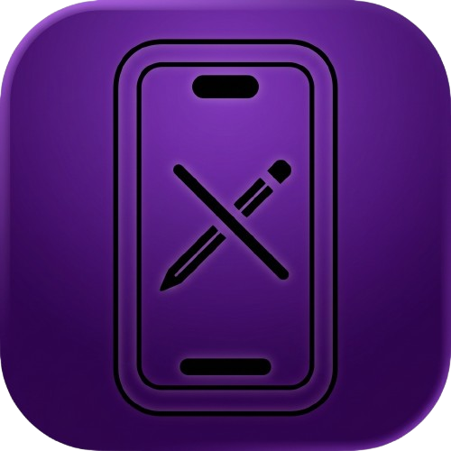

# GestaltEdit (GDEV Edition)

**A modified MobileGestalt utility running directly on iPhone and iPad**

  
  
  

<a href="https://github.com/GDEVTRR/GestaltEdit-for-all-versions/releases/latest"><b>Download IPA</b></a> ·
<a href="#fork-changes">Fork Changes</a> ·
<a href="#requirements">Requirements</a> ·
<a href="#install">Install</a> ·
<a href="#upstream-repo">Upstream</a>

GestaltEdit allows you to edit `com.apple.MobileGestalt.plist` directly on-device with pre-made capability presets, a full field editor, and automatic backup/restore support.

> [!WARNING]
> This app uses private APIs and modifies system cache data. Incorrect MobileGestalt values may break system features or require a full device restore. Proceed at your own risk.

> [!IMPORTANT]
> GestaltEdit is free and open-source. Commercial distribution without authorization is strictly prohibited.

---

## Fork Changes

This repository is a customized fork maintained by **GDEV** with the following enhancements:

- **Bypass Restriction:** Removed the "Unsupported OS version" lock screen.
- **Extended OS Support:** Expanded compatibility range to support **iOS 17 through iOS 27**.
- **New Feature:** Added **Landscape FaceID** tweak preset.

---

## Features

**Presets** — Dynamic Island, Landscape FaceID, device model name, boot chime, charge limit, tap to wake, Camera Control, Apple Pencil, Action Button, Collision SOS, Always-On Display, Stage Manager, Siri AI US region, and more.

**Field Editor** — Search, view, and manually edit any MobileGestalt key when a preset is not available.

**Backups** — Automatic backup before every modification. Easily import, export, and restore configuration files.

---

## Requirements

- iOS / iPadOS 17 – 27
- Developer Mode enabled
- A signing tool or sideloading method (e.g., SideStore, AltStore, iLoader, TrollStore, or LiveContainer)

---

## Install

1. Download `GestaltEdit.ipa` from [Releases](https://github.com/GDEVTRR/GestaltEdit-for-all-versions/releases/latest).
2. Sideload the IPA using your preferred signing tool or installer.
3. If necessary, trust your developer certificate under **Settings → General → VPN & Device Management**.

---

## Upstream Repo

This project is a fork of the original work by [frs0n](https://github.com/frs0n):
- Original Repository: [frs0n/GestaltEdit](https://github.com/frs0n/GestaltEdit)

---

## Credits

- [Nugget](https://github.com/leminlimez/Nugget) — Presets and iPadOS support research
- [FilzaSlop](https://github.com/0xjohnnydev/FilzaSlop), [bad_query](https://github.com/forcequitOS/bad_query), [0xJohnny](https://x.com/0xjohnny) — File access research
- [neospring](https://github.com/rooootdev/neospring) — Respring implementation

Not affiliated with Apple Inc. or the project maintainers listed above.

---

## License

[PolyForm Noncommercial License 1.0.0](LICENSE) — Free for noncommercial use; commercial use is strictly prohibited.
